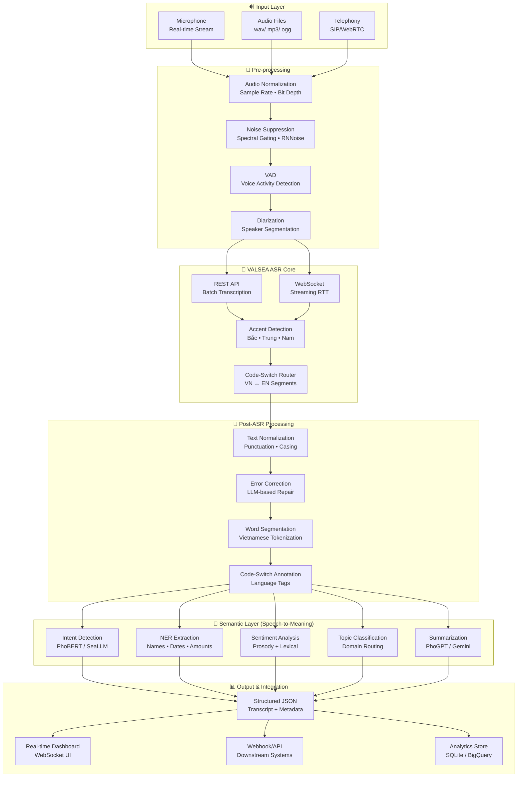

# 🎙️ VALSEA Vietnamese Speech-to-Meaning Platform

**Nền tảng phân tích giọng nói tiếng Việt thông minh — từ âm thanh thô đến ngữ nghĩa có thể hành động**

## Tổng quan

Xây dựng một pipeline xử lý giọng nói end-to-end cho tiếng Việt thực tế (messy speech), tận dụng VALSEA's accent-aware ASR kết hợp các layer NLU/semantic hiện đại. Pipeline xử lý 3 thách thức cốt lõi:

1. **Giọng vùng miền** — Bắc (Hà Nội), Trung (Huế), Nam (Sài Gòn) với sự khác biệt về thanh điệu và phụ âm
2. **Code-switching VN/EN** — Chuyển đổi ngôn ngữ giữa câu và trong câu (intra-sentential)
3. **Nhiễu telephony** — Audio chất lượng thấp, tiếng ồn nền, nén codec

## User Review Required

> [!IMPORTANT]
> **VALSEA API Key Required** — Bạn có sẵn API key từ VALSEA không? Nếu chưa, cần đăng ký tại [api.valsea.ai](https://api.valsea.ai). Pipeline sẽ dùng cả REST endpoint (batch) và WebSocket (real-time streaming).

> [!WARNING]
> **Scope Decision** — Kế hoạch này bao gồm cả demo UI (web dashboard) để visualize pipeline output. Nếu bạn chỉ cần backend pipeline (Python scripts/modules), cho tôi biết để tinh gọn scope.

## Open Questions

1. **Deployment target?** — Chạy local dev (demo/prototype), hay cần production-grade (Docker, cloud)?
2. **Use cases chính?** — Transcription cuộc gọi call center? Meeting minutes? Voice assistant? Medical? Mỗi domain cần custom vocabulary khác nhau.
3. **Data mẫu** — Bạn có sẵn audio files tiếng Việt để test không? Nếu không, pipeline sẽ include synthetic test data generation.
4. **Budget constraint** — VALSEA API tính phí theo phút audio. Bạn có giới hạn budget cho dev/testing không?

---

## Kiến trúc Tổng thể (Architecture Overview)



---

## Proposed Changes — Chi tiết Implementation

### Component 1: Project Scaffold & Core Config

#### [NEW] Project Structure
```
valsea-speech-platform/
├── README.md
├── pyproject.toml                 # uv/pip project config
├── .env.example                   # API key template
├── config/
│   ├── settings.py                # Centralized config (Pydantic Settings)
│   └── accent_profiles.yaml       # Regional accent metadata
├── src/
│   ├── __init__.py
│   ├── pipeline.py                # Main orchestrator
│   ├── preprocessor/
│   │   ├── __init__.py
│   │   ├── audio_normalizer.py    # Sample rate, format conversion
│   │   ├── noise_suppressor.py    # Spectral gating + RNNoise
│   │   ├── vad.py                 # Silero VAD integration
│   │   └── diarizer.py            # Speaker diarization (pyannote)
│   ├── asr/
│   │   ├── __init__.py
│   │   ├── valsea_client.py       # VALSEA REST + WebSocket wrapper
│   │   ├── batch_transcriber.py   # File-based transcription
│   │   └── stream_transcriber.py  # Real-time streaming
│   ├── postprocessor/
│   │   ├── __init__.py
│   │   ├── text_normalizer.py     # Punctuation, capitalization
│   │   ├── error_corrector.py     # LLM-powered ASR error repair
│   │   ├── word_segmenter.py      # Vietnamese word boundaries
│   │   └── codesw_annotator.py    # VN/EN language tagging
│   ├── semantic/
│   │   ├── __init__.py
│   │   ├── intent_detector.py     # Intent classification
│   │   ├── ner_extractor.py       # Named entity recognition
│   │   ├── sentiment_analyzer.py  # Sentiment from text + prosody
│   │   ├── topic_classifier.py    # Topic/domain classification
│   │   └── summarizer.py          # Conversation summarization
│   ├── models/
│   │   ├── __init__.py
│   │   ├── transcript.py          # Pydantic data models
│   │   └── semantic_result.py     # NLU output models
│   └── utils/
│       ├── __init__.py
│       ├── audio_utils.py         # FFmpeg wrappers, format helpers
│       └── logging_config.py      # Structured logging
├── api/
│   ├── __init__.py
│   ├── main.py                    # FastAPI application
│   ├── routes/
│   │   ├── transcribe.py          # POST /transcribe (batch)
│   │   ├── stream.py              # WS /stream (real-time)
│   │   └── analyze.py             # POST /analyze (semantic)
│   └── middleware/
│       └── rate_limiter.py
├── dashboard/                     # Web UI (optional)
│   ├── index.html
│   ├── index.css
│   └── app.js
├── tests/
│   ├── test_preprocessor.py
│   ├── test_asr.py
│   ├── test_postprocessor.py
│   ├── test_semantic.py
│   └── fixtures/
│       └── sample_audio/          # Test audio files
├── scripts/
│   ├── demo_batch.py              # Demo: batch transcription
│   ├── demo_realtime.py           # Demo: real-time streaming
│   └── evaluate_wer.py            # WER evaluation script
└── docs/
    ├── architecture.md
    └── accent_guide.md
```

---

### Component 2: Audio Pre-processing Pipeline

#### [NEW] `src/preprocessor/audio_normalizer.py`
- Chuẩn hóa audio về 16kHz mono PCM16 (format tối ưu cho ASR)
- Hỗ trợ đầu vào: `.wav`, `.mp3`, `.ogg`, `.flac`, `.m4a`, raw telephony (8kHz μ-law)
- Sử dụng `pydub` + `ffmpeg` cho conversion
- Auto-detect và upscale telephony audio (8kHz → 16kHz với bandpass filter)

#### [NEW] `src/preprocessor/noise_suppressor.py`
- **Tầng 1**: Spectral gating (noisereduce library) — loại bỏ background noise ổn định
- **Tầng 2**: RNNoise (deep learning denoiser) — xử lý nhiễu non-stationary
- Telephony-specific: xử lý echo, codec artifacts, GSM compression noise
- Output: cleaned audio + SNR estimate (để route tới model phù hợp)

#### [NEW] `src/preprocessor/vad.py`
- Silero VAD — lightweight, accurate voice activity detection
- Cắt audio thành speech segments, loại bỏ silence dài
- Output timestamps cho mỗi speech segment → giảm API cost (chỉ gửi phần có giọng nói)

#### [NEW] `src/preprocessor/diarizer.py`
- Speaker diarization nhẹ (embedding-based clustering)
- Xác định "ai đang nói" — quan trọng cho meeting/call center
- Output: speaker labels gắn với từng segment

---

### Component 3: VALSEA ASR Integration — Lõi hệ thống

#### [NEW] `src/asr/valsea_client.py`
**Đây là component sáng tạo nhất — wrapper thông minh cho VALSEA API:**

```python
# Pseudo-architecture
class ValseaClient:
    """Smart wrapper with accent-aware routing and code-switch handling."""
    
    async def transcribe_batch(self, audio_path, config) -> TranscriptResult:
        """REST API — gửi file, nhận transcript."""
        # 1. Detect accent region từ first 5s audio
        # 2. Set language hints phù hợp
        # 3. Enable code-switching mode
        # 4. Post-process với Vietnamese-specific normalization
    
    async def stream_realtime(self, audio_stream, on_partial, on_final):
        """WebSocket — streaming real-time transcription."""
        # 1. Mở WS connection tới VALSEA
        # 2. Stream audio chunks (100ms frames)
        # 3. Nhận partial results → emit callback
        # 4. Nhận final results → emit callback
        # 5. Auto-reconnect on disconnect
```

**Chiến lược Accent Handling:**
| Vùng | Đặc điểm | Xử lý |
|------|-----------|-------|
| Bắc (Hà Nội) | 6 thanh đầy đủ, phân biệt rõ ch/tr, s/x | Baseline model, ít cần correction |
| Trung (Huế) | Thanh nặng/ngã merge, vowel shift | Boost confidence threshold, enable dialect hints |
| Nam (Sài Gòn) | v→d, merge hỏi/ngã, gi→d | Custom post-correction rules, frequency-based repair |

**Code-Switching Strategy:**
- VALSEA native multilingual mode: `language=multi` hoặc `language=["vi", "en"]`
- Phrase boosting cho English technical terms phổ biến (meeting, deadline, feedback, KPI...)
- Post-processing: tag language boundaries `<vi>...</vi><en>...</en>`

---

### Component 4: Post-ASR Processing — Làm sạch & Làm giàu

#### [NEW] `src/postprocessor/text_normalizer.py`
- Thêm dấu câu (., ?, !) — critical vì ASR output thường thiếu
- Chuẩn hóa số: "hai trăm nghìn" → "200,000" hoặc giữ nguyên tùy context
- Viết hoa đúng (tên riêng, đầu câu)
- Normalize informal speech: "ko" → "không", "dc" → "được"

#### [NEW] `src/postprocessor/error_corrector.py`
- **Innovation**: Dùng LLM (Gemini/PhoGPT) để sửa lỗi ASR dựa trên context
- Input: raw transcript + confidence scores
- Prompt engineering: "Sửa lỗi transcription tiếng Việt, giữ nguyên ý nghĩa, chú ý thanh điệu"
- Fallback: rule-based correction cho common ASR errors (homophone confusion)

#### [NEW] `src/postprocessor/word_segmenter.py`
- Vietnamese word segmentation (VnCoreNLP hoặc underthesea)
- Critical cho downstream NLU — tiếng Việt không có khoảng trắng tự nhiên giữa từ ghép
- Example: "thành phố Hồ Chí Minh" — "thành_phố" là 1 từ, "Hồ_Chí_Minh" là 1 entity

#### [NEW] `src/postprocessor/codesw_annotator.py`
- Detect và annotate code-switched segments
- Output: `[{"text": "Anh ơi gửi em cái", "lang": "vi"}, {"text": "report", "lang": "en"}, {"text": "trước", "lang": "vi"}, {"text": "deadline", "lang": "en"}, {"text": "nhé", "lang": "vi"}]`
- Metrics: code-switch frequency, dominant language ratio

---

### Component 5: Semantic Layer — Speech-to-Meaning

#### [NEW] `src/semantic/intent_detector.py`
- Phân loại intent từ transcript (PhoBERT fine-tuned hoặc Gemini zero-shot)
- Example intents: `request_info`, `complaint`, `booking`, `technical_support`
- Hỗ trợ custom intent sets per domain

#### [NEW] `src/semantic/ner_extractor.py`
- Named Entity Recognition cho Vietnamese
- Entities: PER (người), ORG (tổ chức), LOC (địa điểm), DATE, MONEY, PHONE, EMAIL
- Xử lý entities code-switched: "công ty Google" → ORG: "Google"

#### [NEW] `src/semantic/sentiment_analyzer.py`
- **Dual-signal sentiment**: 
  - Lexical sentiment từ text (PhoBERT-based)
  - Prosody sentiment từ audio features (nếu VALSEA trả prosody data)
- Output: positive/negative/neutral + intensity score + emotion labels

#### [NEW] `src/semantic/summarizer.py`
- Tóm tắt cuộc hội thoại bằng LLM (Gemini API / PhoGPT)
- Output: bullet-point summary, action items, key decisions
- Bilingual summary support: tóm tắt bằng tiếng Việt cho Vietnamese segments, English cho EN segments

---

### Component 6: FastAPI Backend

#### [NEW] `api/main.py`
```
POST /api/v1/transcribe        — Upload audio file, get full transcript + analysis
POST /api/v1/transcribe/url    — Transcribe from audio URL
WS   /api/v1/stream            — Real-time streaming transcription
POST /api/v1/analyze            — Run semantic analysis on existing transcript
GET  /api/v1/jobs/{job_id}     — Check async job status
GET  /api/v1/health            — Health check
```

---

### Component 7: Real-time Dashboard (Web UI)

#### [NEW] `dashboard/index.html` + `index.css` + `app.js`

**Thiết kế UI đổi mới:**
- **Live Waveform Visualizer** — hiển thị audio waveform real-time khi đang ghi âm/stream
- **Dual-pane Transcript** — bên trái: raw transcript với color-coded language tags (VN=blue, EN=green); bên phải: semantic analysis results
- **Accent Heatmap** — visualize accent confidence per segment
- **Sentiment Timeline** — biểu đồ sentiment theo thời gian cuộc hội thoại
- **Dark mode** mặc định với glassmorphism cards
- **File upload** drag-and-drop + microphone recording button

---

## Điểm Sáng Tạo & Đổi Mới

### 🌟 1. Adaptive Accent Router
Không chỉ transcribe — pipeline tự động detect vùng miền từ 5 giây đầu tiên và adjust parameters. Khi accent thay đổi mid-conversation (người Bắc nói chuyện với người Nam), router điều chỉnh real-time.

### 🌟 2. Context-Aware Code-Switch Repair
Thay vì chỉ transcribe VN/EN riêng lẻ, pipeline hiểu **context chuyển đổi**:
- "Anh book cho em cái phòng" → detect "book" là verb tiếng Anh trong context tiếng Việt
- "Em check cái report rồi send lại" → reconstruct bilingual meaning

### 🌟 3. Telephony-Grade Noise Resilience
Pipeline 3 tầng denoising: spectral gating → RNNoise → confidence-weighted decoding. Optimized cho audio 8kHz GSM codec — thực tế call center Việt Nam.

### 🌟 4. LLM Post-Correction Loop
ASR output được "review" bởi LLM để sửa lỗi ngữ cảnh mà statistical model bỏ sót:
- "bán hàng" vs "bàn hàng" — LLM dùng context câu để chọn đúng
- "three hundred" trong câu tiếng Việt → normalize thành "ba trăm" hoặc giữ tùy preference

### 🌟 5. Prosody-Lexical Sentiment Fusion
Kết hợp **giọng nói** (tốc độ nói, pitch variance, energy) với **nội dung text** để phân tích cảm xúc chính xác hơn. Người Việt thường nói "được rồi" với tone khác nhau có ý nghĩa hoàn toàn khác.

---

## Tech Stack

| Layer | Technology | Lý do chọn |
|-------|-----------|-------------|
| ASR | VALSEA API (REST + WebSocket) | Accent-aware, SEA-optimized |
| Audio Processing | pydub, noisereduce, Silero VAD | Lightweight, battle-tested |
| NLU | PhoBERT, underthesea, VnCoreNLP | Vietnamese-native NLP tools |
| LLM | Gemini API (via google-genai) | Powerful multilingual reasoning |
| Backend | FastAPI + uvicorn | Async-first, WebSocket support |
| Frontend | Vanilla HTML/CSS/JS | Lightweight, no framework overhead |
| Data Models | Pydantic v2 | Strict typing, serialization |
| Package Manager | uv | Fast, modern Python packaging |

---

## Verification Plan

### Automated Tests
```bash
# Unit tests for each component
uv run pytest tests/ -v

# WER evaluation on sample audio
uv run python scripts/evaluate_wer.py --audio tests/fixtures/sample_audio/

# API endpoint tests
uv run pytest tests/test_api.py -v
```

### Manual Verification
1. **Accent Test**: Transcribe 3 audio clips (Bắc, Trung, Nam) → verify accuracy
2. **Code-Switch Test**: Transcribe mixed VN/EN conversation → verify language tags
3. **Noise Test**: Transcribe telephony-quality audio → compare with clean audio results
4. **Dashboard**: Open web UI → upload file → verify real-time visualization
5. **Streaming**: Record from microphone → verify live transcription latency < 500ms

---

## Phasing

| Phase | Scope | Effort |
|-------|-------|--------|
| **Phase 1** | Core pipeline: preprocessor + VALSEA client + basic post-processing | ~2-3 hours |
| **Phase 2** | Semantic layer: intent, NER, sentiment, summarization | ~2 hours |
| **Phase 3** | FastAPI backend with REST + WebSocket endpoints | ~1-2 hours |
| **Phase 4** | Dashboard UI with real-time visualization | ~2 hours |
| **Phase 5** | Testing, evaluation, documentation | ~1 hour |

> [!TIP]
> Tôi đề xuất build **Phase 1 + Phase 3** trước (core pipeline + API) để bạn có thể test end-to-end sớm. Dashboard (Phase 4) có thể add sau.
